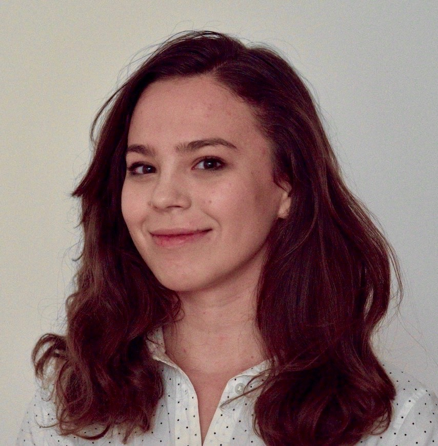

Hey there! I'm a **senior** studying math and computer science ([course 18C](https://math.mit.edu/academics/undergrad/major/course18c.php)) at MIT. 

## About Me

I am broadly interested in the use of **deep learning** and **Bayesian methods** for simulation and parameterization of complex processes.

Outside of academics, I represent undergraduates in the MIT math department via the Committee for Math Majors (CoMM).

## Research

This fall, I joined the [Climate Modeling Alliance](https://clima.caltech.edu/) to work with [Raffaele Ferrari](http://ferrari.mit.edu/) on leveraging **inference** and **machine learning** methods to develop novel parameterizations of **turbulence** and **stochastic dynamics** in large-scale planetary flows as an [MIT Quest for Intelligence](https://quest.mit.edu/) [Advanced Undergraduate Research Scholar](https://superurop.mit.edu/).

Previously, I was an undergraduate research assistant in [Josh Tenenbaum](https://web.mit.edu/cocosci/josh.html)'s lab, studying (1) the **cognitive bases of strategy learning**, (2) **hierarchical reinforcement learning**, and (3) **deep learning algorithms** for **fluid manipulation tasks**.

## Publications

1. \*KR.Allen, \*KA.Smith, **U.Piterbarg**, R.Chen, JB.Tenenbaum: [*Abstract strategy learning underlies flexible transfer in physical problem solving*](docs/cogsci2020.pdf). CogSci 2020.
